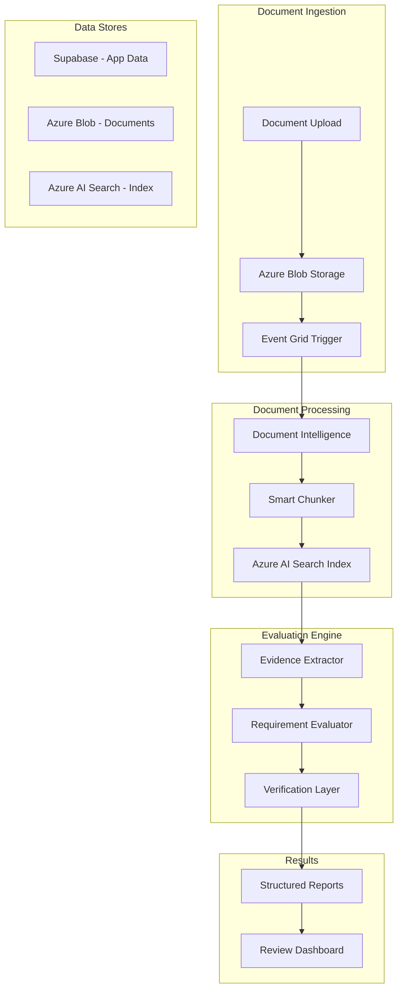

# ISO 14971 Compliance Document Processing Pipeline
## Comprehensive Technical Architecture & Implementation Guide

### Executive Summary

This document outlines a production-ready pipeline for automated evaluation of medical device documentation against ISO 14971/TR 24971 requirements. The system processes long-form documents, evaluates ~40 regulatory requirements, and produces structured compliance reports with granular citations and confidence metrics.

**Key Architecture Decisions:**
- Azure for document storage and search (compliance requirements)
- Supabase for application data and orchestration state
- Two-phase evaluation: document understanding → requirement checking
- Progressive enhancement from MVP to full system

---

## 1. System Architecture

### 1.1 High-Level Architecture



### 1.2 Technology Stack

| Component | Technology | Purpose | Rationale |
|-----------|-----------|---------|-----------|
| Document Storage | Azure Blob Storage | Raw document storage | Compliance requirement, audit trail |
| Document Processing | Azure Document Intelligence | OCR, layout analysis | Superior table/structure extraction |
| Search Index | Azure AI Search | Semantic search, retrieval | Compliance data residency |
| Application Database | Supabase (PostgreSQL) | App state, results, users | Existing infrastructure |
| Orchestration | Azure Durable Functions | Workflow coordination | Native Azure integration |
| Evaluation Engine | Azure OpenAI (GPT-4o/4.1) | Requirement evaluation | Best accuracy for compliance |
| Monitoring | Application Insights | Observability | Azure native monitoring |
| API Layer | Azure Functions / FastAPI | REST endpoints | Depends on team preference |

---

## 2. Data Models & Contracts

### 2.1 Core Entities

#### Document Entity
```typescript
interface Document {
  id: string;                    // UUID
  org_id: string;                // Multi-tenant isolation
  filename: string;
  blob_url: string;              // Azure Blob URL
  upload_date: Date;
  document_type: 'risk_management_file' | 'design_specification' | 'validation_report' | 'other';
  status: 'uploaded' | 'processing' | 'analyzed' | 'evaluated' | 'error';
  metadata: {
    page_count: number;
    file_size: number;
    mime_type: string;
    document_version?: string;
    product_family?: string;
    regulatory_class?: string;
  };
  processing_metadata?: {
    extraction_job_id: string;
    index_version: string;
    chunk_count: number;
    table_count: number;
  };
}
```

#### Requirement Entity
```typescript
interface Requirement {
  id: string;                    // From registry
  clause_number: string;         // e.g., "4.1.2"
  category: string;              // e.g., "Risk Management Planning"
  subcategory?: string;
  text: string;                  // Full requirement text
  priority: 'must' | 'should' | 'nice';
  evaluation_hints: string[];    // Keywords/phrases to look for
  typical_evidence_types: string[]; // e.g., ["risk_matrix", "fmea_table"]
  version: string;
  active: boolean;
}
```

#### Document Understanding Context
```typescript
interface DocumentContext {
  document_id: string;
  extracted_at: Date;
  structure: {
    sections: Section[];
    tables: ExtractedTable[];
    figures: Figure[];
    cross_references: Reference[];
  };
  risk_artifacts: {
    risk_matrices: RiskMatrix[];
    fmea_tables: FMEATable[];
    hazard_analyses: HazardAnalysis[];
    control_measures: ControlMeasure[];
  };
  compliance_indicators: {
    mentions_iso14971: boolean;
    has_risk_management_plan: boolean;
    has_risk_assessment: boolean;
    has_verification_validation: boolean;
  };
}
```

#### Evidence Record
```typescript
interface Evidence {
  requirement_id: string;
  document_id: string;
  evidence_type: 'direct' | 'indirect' | 'absent';
  strength: 'strong' | 'moderate' | 'weak';
  artifacts: Array<{
    type: 'text' | 'table' | 'figure' | 'section';
    location: {
      page: number;
      section_path: string[];      // e.g., ["4", "4.1", "4.1.2"]
      bbox?: [number, number, number, number];
    };
    content: string;
    relevance_score: number;        // 0-1
    matching_concepts: string[];    // What matched
  }>;
  gaps?: string[];                  // What's missing for full compliance
}
```

#### Evaluation Result
```typescript
interface EvaluationResult {
  id: string;
  document_id: string;
  requirement_id: string;
  run_id: string;                   // For versioning
  evaluated_at: Date;
  
  // Core verdict
  status: 'PASS' | 'FAIL' | 'NEEDS_ATTENTION';
  
  // Detailed assessment
  assessment: {
    rationale: string;              // Why this verdict
    evidence_summary: string;       // What was found
    confidence_metrics: {
      evidence_strength: 'strong' | 'moderate' | 'weak';
      coverage: 'complete' | 'partial' | 'minimal';
      interpretation_risk: 'low' | 'medium' | 'high';
    };
  };
  
  // Citations
  citations: Array<{
    page: number;
    quote: string;                  // Exact text
    section_id?: string;
    bbox?: [number, number, number, number];
    confidence: number;
  }>;
  
  // For FAIL status
  gap_analysis?: {
    missing_elements: string[];
    suggested_sections: string[];   // Where it could be added
    example_language?: string;      // Template text
  };
  
  // Audit trail
  evaluation_metadata: {
    model_version: string;
    prompt_version: string;
    retrieval_count: number;
    tokens_used: number;
  };
}
```

### 2.2 Azure AI Search Index Schema

```json
{
  "name": "iso14971-compliance-index",
  "fields": [
    {"name": "id", "type": "Edm.String", "key": true},
    {"name": "document_id", "type": "Edm.String", "filterable": true},
    {"name": "org_id", "type": "Edm.String", "filterable": true},
    {"name": "chunk_text", "type": "Edm.String", "searchable": true},
    {"name": "chunk_embedding", "type": "Collection(Edm.Single)", "dimensions": 1536},
    {"name": "page_number", "type": "Edm.Int32", "filterable": true, "sortable": true},
    {"name": "section_hierarchy", "type": "Collection(Edm.String)", "filterable": true},
    {"name": "artifact_type", "type": "Edm.String", "filterable": true},
    {"name": "table_content", "type": "Edm.String", "searchable": true},
    {"name": "has_risk_content", "type": "Edm.Boolean", "filterable": true},
    {"name": "regulatory_keywords", "type": "Collection(Edm.String)", "filterable": true},
    {"name": "bbox_coordinates", "type": "Edm.String"},
    {"name": "confidence_score", "type": "Edm.Double", "filterable": true},
    {"name": "created_at", "type": "Edm.DateTimeOffset", "filterable": true}
  ],
  "suggesters": [],
  "scoringProfiles": [
    {
      "name": "regulatory_boost",
      "text": {
        "weights": {
          "chunk_text": 1.0,
          "table_content": 1.5,
          "regulatory_keywords": 2.0
        }
      }
    }
  ],
  "semantic": {
    "configurations": [
      {
        "name": "iso14971-semantic",
        "prioritizedFields": {
          "titleField": null,
          "prioritizedContentFields": [
            {"fieldName": "chunk_text"},
            {"fieldName": "table_content"}
          ],
          "prioritizedKeywordsFields": [
            {"fieldName": "regulatory_keywords"}
          ]
        }
      }
    ]
  }
}
```

---

## 3. Processing Pipeline

### 3.1 Phase 1: Document Ingestion & Understanding

#### Step 1: Document Upload & Trigger
```python
# Azure Function: on_blob_upload
import json
from azure.storage.blob import BlobServiceClient
from azure.eventgrid import EventGridPublisherClient
import uuid

async def on_document_upload(blob_url: str, org_id: str):
    # 1. Register document in Supabase
    doc_id = str(uuid.uuid4())
    document = {
        "id": doc_id,
        "org_id": org_id,
        "blob_url": blob_url,
        "status": "uploaded",
        "upload_date": datetime.utcnow()
    }
    await supabase.table("documents").insert(document)
    
    # 2. Trigger processing pipeline
    event = {
        "id": str(uuid.uuid4()),
        "eventType": "Document.Process.Start",
        "subject": f"documents/{doc_id}",
        "data": {
            "document_id": doc_id,
            "org_id": org_id,
            "blob_url": blob_url
        }
    }
    await event_grid_client.send([event])
```

#### Step 2: Document Intelligence Extraction
```python
# Azure Durable Function: extract_document_intelligence
from azure.ai.formrecognizer import DocumentAnalysisClient
from typing import List, Dict

class DocumentExtractor:
    def __init__(self):
        self.client = DocumentAnalysisClient(
            endpoint=AZURE_FORM_RECOGNIZER_ENDPOINT,
            credential=DefaultAzureCredential()
        )
    
    async def extract_with_structure(self, blob_url: str) -> Dict:
        # Use prebuilt-layout for maximum structure preservation
        poller = self.client.begin_analyze_document_from_url(
            "prebuilt-layout", 
            blob_url
        )
        result = poller.result()
        
        # Extract hierarchical structure
        document_structure = {
            "pages": [],
            "tables": [],
            "sections": [],
            "paragraphs": []
        }
        
        # Process pages with coordinate preservation
        for page in result.pages:
            page_data = {
                "page_number": page.page_number,
                "width": page.width,
                "height": page.height,
                "lines": [],
                "tables_on_page": []
            }
            
            for line in page.lines:
                page_data["lines"].append({
                    "text": line.content,
                    "bbox": line.bounding_box,
                    "confidence": line.confidence
                })
            
            document_structure["pages"].append(page_data)
        
        # Extract tables with structure
        for table in result.tables:
            table_data = {
                "row_count": table.row_count,
                "column_count": table.column_count,
                "cells": [],
                "page": table.bounding_regions[0].page_number if table.bounding_regions else None,
                "bbox": table.bounding_regions[0].bounding_box if table.bounding_regions else None
            }
            
            for cell in table.cells:
                table_data["cells"].append({
                    "row": cell.row_index,
                    "column": cell.column_index,
                    "text": cell.content,
                    "row_span": cell.row_span,
                    "column_span": cell.column_span
                })
            
            # Identify if this is a risk-related table
            table_text = " ".join([c["text"] for c in table_data["cells"]])
            if self._is_risk_table(table_text):
                table_data["artifact_type"] = self._classify_risk_table(table_text)
            
            document_structure["tables"].append(table_data)
        
        # Build section hierarchy
        document_structure["sections"] = self._build_section_hierarchy(result)
        
        return document_structure
    
    def _is_risk_table(self, text: str) -> bool:
        risk_indicators = [
            "severity", "probability", "risk level", "hazard",
            "fmea", "failure mode", "control measure", "mitigation",
            "risk assessment", "risk matrix", "acceptability"
        ]
        text_lower = text.lower()
        return any(indicator in text_lower for indicator in risk_indicators)
    
    def _classify_risk_table(self, text: str) -> str:
        text_lower = text.lower()
        if "fmea" in text_lower or "failure mode" in text_lower:
            return "fmea_table"
        elif "risk matrix" in text_lower or ("severity" in text_lower and "probability" in text_lower):
            return "risk_matrix"
        elif "hazard" in text_lower:
            return "hazard_analysis"
        elif "control" in text_lower or "mitigation" in text_lower:
            return "control_measures"
        return "risk_related_table"
    
    def _build_section_hierarchy(self, result) -> List[Dict]:
        """Build document hierarchy from headings and structure"""
        sections = []
        current_hierarchy = []
        
        for paragraph in result.paragraphs:
            if paragraph.role == "heading":
                level = self._determine_heading_level(paragraph)
                
                # Adjust hierarchy stack
                current_hierarchy = current_hierarchy[:level]
                current_hierarchy.append(paragraph.content)
                
                sections.append({
                    "path": current_hierarchy.copy(),
                    "title": paragraph.content,
                    "level": level,
                    "page": paragraph.bounding_regions[0].page_number,
                    "content_start": paragraph.bounding_regions[0].bounding_box
                })
        
        return sections
```

#### Step 3: Intelligent Chunking Strategy
```python
class IntelligentChunker:
    def __init__(self, max_chunk_size: int = 1500, overlap: int = 200):
        self.max_chunk_size = max_chunk_size
        self.overlap = overlap
    
    def chunk_with_context(self, document_structure: Dict) -> List[Dict]:
        chunks = []
        
        # 1. Process regular text chunks with section awareness
        for section in document_structure["sections"]:
            section_chunks = self._chunk_section(section, document_structure)
            chunks.extend(section_chunks)
        
        # 2. Keep tables as atomic chunks (never split tables)
        for table in document_structure["tables"]:
            table_chunk = {
                "id": str(uuid.uuid4()),
                "type": "table",
                "content": self._serialize_table(table),
                "page": table["page"],
                "bbox": table["bbox"],
                "artifact_type": table.get("artifact_type", "table"),
                "section_path": self._find_section_for_page(
                    table["page"], 
                    document_structure["sections"]
                ),
                "metadata": {
                    "row_count": table["row_count"],
                    "column_count": table["column_count"],
                    "has_risk_content": bool(table.get("artifact_type"))
                }
            }
            chunks.append(table_chunk)
        
        # 3. Create cross-reference chunks for better retrieval
        cross_refs = self._extract_cross_references(document_structure)
        for ref in cross_refs:
            chunks.append({
                "id": str(uuid.uuid4()),
                "type": "cross_reference",
                "content": ref["context"],
                "source_section": ref["source"],
                "target_section": ref["target"],
                "page": ref["page"]
            })
        
        return chunks
    
    def _chunk_section(self, section: Dict, doc_structure: Dict) -> List[Dict]:
        """Chunk a section while preserving context"""
        chunks = []
        
        # Get all text in this section
        section_text = self._extract_section_text(section, doc_structure)
        
        if len(section_text) <= self.max_chunk_size:
            # Small section - keep as single chunk
            chunks.append({
                "id": str(uuid.uuid4()),
                "type": "text",
                "content": section_text,
                "section_path": section["path"],
                "page": section["page"],
                "metadata": {
                    "section_title": section["title"],
                    "heading_level": section["level"]
                }
            })
        else:
            # Large section - chunk with overlap
            words = section_text.split()
            
            for i in range(0, len(words), self.max_chunk_size - self.overlap):
                chunk_words = words[i:i + self.max_chunk_size]
                chunk_text = " ".join(chunk_words)
                
                # Add context prefix
                context_prefix = f"[Section: {' > '.join(section['path'])}]\n"
                
                chunks.append({
                    "id": str(uuid.uuid4()),
                    "type": "text",
                    "content": context_prefix + chunk_text,
                    "section_path": section["path"],
                    "page": section["page"],
                    "metadata": {
                        "section_title": section["title"],
                        "chunk_index": len(chunks),
                        "is_continuation": i > 0
                    }
                })
        
        return chunks
    
    def _serialize_table(self, table: Dict) -> str:
        """Convert table to searchable text while preserving structure"""
        # Create markdown table for better LLM understanding
        rows = []
        
        # Group cells by row
        cells_by_row = {}
        for cell in table["cells"]:
            row_idx = cell["row"]
            if row_idx not in cells_by_row:
                cells_by_row[row_idx] = []
            cells_by_row[row_idx].append(cell)
        
        # Build markdown
        markdown = []
        for row_idx in sorted(cells_by_row.keys()):
            row_cells = sorted(cells_by_row[row_idx], key=lambda x: x["column"])
            row_text = " | ".join([cell["text"] for cell in row_cells])
            markdown.append(f"| {row_text} |")
            
            # Add separator after header row
            if row_idx == 0:
                sep = " | ".join(["---"] * len(row_cells))
                markdown.append(f"| {sep} |")
        
        return "\n".join(markdown)
```

#### Step 4: Indexing with Azure AI Search
```python
from azure.search.documents import SearchClient
from azure.search.documents.indexes import SearchIndexClient
from azure.core.credentials import AzureKeyCredential
import numpy as np

class AzureSearchIndexer:
    def __init__(self):
        self.search_client = SearchClient(
            endpoint=AZURE_SEARCH_ENDPOINT,
            index_name="iso14971-compliance-index",
            credential=AzureKeyCredential(AZURE_SEARCH_KEY)
        )
        self.embedder = AzureOpenAIEmbedder()
    
    async def index_chunks(self, chunks: List[Dict], document_id: str, org_id: str):
        # Batch process embeddings
        texts = [c["content"] for c in chunks]
        embeddings = await self.embedder.batch_embed(texts)
        
        # Prepare documents for indexing
        search_documents = []
        for chunk, embedding in zip(chunks, embeddings):
            # Extract regulatory keywords for filtering
            regulatory_keywords = self._extract_regulatory_keywords(chunk["content"])
            
            search_doc = {
                "id": f"{document_id}_{chunk['id']}",
                "document_id": document_id,
                "org_id": org_id,
                "chunk_text": chunk["content"],
                "chunk_embedding": embedding.tolist(),
                "page_number": chunk.get("page"),
                "section_hierarchy": chunk.get("section_path", []),
                "artifact_type": chunk.get("artifact_type", chunk["type"]),
                "table_content": chunk["content"] if chunk["type"] == "table" else None,
                "has_risk_content": self._has_risk_content(chunk),
                "regulatory_keywords": regulatory_keywords,
                "bbox_coordinates": json.dumps(chunk.get("bbox")) if chunk.get("bbox") else None,
                "confidence_score": chunk.get("metadata", {}).get("confidence", 1.0),
                "created_at": datetime.utcnow()
            }
            search_documents.append(search_doc)
        
        # Upload in batches
        batch_size = 100
        for i in range(0, len(search_documents), batch_size):
            batch = search_documents[i:i + batch_size]
            result = self.search_client.upload_documents(documents=batch)
            
            # Log any failures
            for r in result:
                if not r.succeeded:
                    logger.error(f"Failed to index chunk {r.key}: {r.error_message}")
    
    def _extract_regulatory_keywords(self, text: str) -> List[str]:
        """Extract ISO 14971 specific keywords"""
        keywords = []
        text_lower = text.lower()
        
        # ISO 14971 specific terms
        iso_terms = [
            "risk management", "risk analysis", "risk evaluation",
            "risk control", "residual risk", "risk/benefit analysis",
            "production and post-production", "hazardous situation",
            "severity", "probability of occurrence", "risk acceptability",
            "risk management file", "risk management plan",
            "verification", "validation", "fmea", "fta", "hazard"
        ]
        
        for term in iso_terms:
            if term in text_lower:
                keywords.append(term)
        
        # Extract clause references (e.g., "4.1.2", "Clause 5.2")
        import re
        clause_pattern = r'\b(?:clause\s+)?(\d+(?:\.\d+)*)\b'
        clauses = re.findall(clause_pattern, text_lower)
        keywords.extend([f"clause_{c}" for c in clauses])
        
        return keywords
    
    def _has_risk_content(self, chunk: Dict) -> bool:
        """Determine if chunk contains risk-related content"""
        if chunk.get("artifact_type", "").startswith("risk"):
            return True
        
        risk_indicators = [
            "risk", "hazard", "severity", "probability",
            "mitigation", "control", "fmea", "safety"
        ]
        text_lower = chunk["content"].lower()
        return any(indicator in text_lower for indicator in risk_indicators)
```

### 3.2 Phase 2: Evidence Extraction & Requirement Evaluation

#### Step 5: Evidence Extraction
```python
class EvidenceExtractor:
    def __init__(self, search_client: SearchClient):
        self.search_client = search_client
        self.embedder = AzureOpenAIEmbedder()
    
    async def extract_evidence(
        self, 
        requirement: Requirement, 
        document_id: str,
        org_id: str
    ) -> Evidence:
        # 1. Build smart query from requirement
        query = self._build_smart_query(requirement)
        
        # 2. Perform hybrid search
        search_results = await self._hybrid_search(
            query=query,
            document_id=document_id,
            org_id=org_id,
            top_k=10
        )
        
        # 3. Analyze results for evidence
        artifacts = []
        for result in search_results:
            relevance = self._assess_relevance(result, requirement)
            if relevance["score"] > 0.5:
                artifacts.append({
                    "type": result["artifact_type"],
                    "location": {
                        "page": result["page_number"],
                        "section_path": result["section_hierarchy"],
                        "bbox": json.loads(result.get("bbox_coordinates", "null"))
                    },
                    "content": result["chunk_text"],
                    "relevance_score": relevance["score"],
                    "matching_concepts": relevance["matching_concepts"]
                })
        
        # 4. Determine evidence type and strength
        if not artifacts:
            evidence_type = "absent"
            strength = "weak"
        elif any(a["relevance_score"] > 0.8 for a in artifacts):
            evidence_type = "direct"
            strength = "strong"
        else:
            evidence_type = "indirect"
            strength = "moderate" if len(artifacts) > 2 else "weak"
        
        # 5. Identify gaps
        gaps = self._identify_gaps(requirement, artifacts)
        
        return Evidence(
            requirement_id=requirement.id,
            document_id=document_id,
            evidence_type=evidence_type,
            strength=strength,
            artifacts=artifacts,
            gaps=gaps
        )
    
    def _build_smart_query(self, requirement: Requirement) -> Dict:
        """Build an intelligent query from requirement"""
        # Extract key concepts using NLP
        key_phrases = self._extract_key_phrases(requirement.text)
        
        # Add evaluation hints
        search_terms = key_phrases + requirement.evaluation_hints
        
        # Build query object
        return {
            "text": requirement.text,
            "search_terms": search_terms,
            "typical_evidence": requirement.typical_evidence_types,
            "filters": {
                "has_risk_content": True if "risk" in requirement.text.lower() else None,
                "artifact_types": requirement.typical_evidence_types
            }
        }
    
    async def _hybrid_search(
        self, 
        query: Dict, 
        document_id: str,
        org_id: str,
        top_k: int = 10
    ) -> List[Dict]:
        # 1. Vector search
        query_embedding = await self.embedder.embed(query["text"])
        
        vector_results = self.search_client.search(
            search_text=None,
            vector_queries=[{
                "vector": query_embedding.tolist(),
                "k_nearest_neighbors": top_k,
                "fields": "chunk_embedding"
            }],
            filter=f"document_id eq '{document_id}' and org_id eq '{org_id}'",
            select=["id", "chunk_text", "page_number", "section_hierarchy", 
                   "artifact_type", "bbox_coordinates", "table_content"],
            top=top_k
        )
        
        # 2. Keyword search (for specific terms)
        keyword_results = self.search_client.search(
            search_text=" ".join(query["search_terms"]),
            filter=f"document_id eq '{document_id}' and org_id eq '{org_id}'",
            scoring_profile="regulatory_boost",
            select=["id", "chunk_text", "page_number", "section_hierarchy",
                   "artifact_type", "bbox_coordinates", "table_content"],
            top=top_k
        )
        
        # 3. Semantic search (if configured)
        semantic_results = self.search_client.search(
            search_text=query["text"],
            query_type="semantic",
            semantic_configuration_name="iso14971-semantic",
            filter=f"document_id eq '{document_id}' and org_id eq '{org_id}'",
            select=["id", "chunk_text", "page_number", "section_hierarchy",
                   "artifact_type", "bbox_coordinates", "table_content"],
            top=top_k
        )
        
        # 4. Merge and deduplicate results
        all_results = {}
        
        # Weight different search types
        for result in vector_results:
            all_results[result["id"]] = {
                **result,
                "score": result.get("@search.score", 0) * 1.0
            }
        
        for result in keyword_results:
            if result["id"] in all_results:
                all_results[result["id"]]["score"] += result.get("@search.score", 0) * 0.8
            else:
                all_results[result["id"]] = {
                    **result,
                    "score": result.get("@search.score", 0) * 0.8
                }
        
        for result in semantic_results:
            if result["id"] in all_results:
                all_results[result["id"]]["score"] += result.get("@search.reranker_score", 0) * 1.2
            else:
                all_results[result["id"]] = {
                    **result,
                    "score": result.get("@search.reranker_score", 0) * 1.2
                }
        
        # Sort by combined score
        sorted_results = sorted(
            all_results.values(), 
            key=lambda x: x["score"], 
            reverse=True
        )
        
        return sorted_results[:top_k]
    
    def _assess_relevance(self, search_result: Dict, requirement: Requirement) -> Dict:
        """Assess how relevant a search result is to a requirement"""
        matching_concepts = []
        score = 0.0
        
        result_text = search_result["chunk_text"].lower()
        
        # Check for evaluation hints
        for hint in requirement.evaluation_hints:
            if hint.lower() in result_text:
                matching_concepts.append(hint)
                score += 0.2
        
        # Check for typical evidence types
        if search_result["artifact_type"] in requirement.typical_evidence_types:
            score += 0.3
        
        # Check for clause references
        import re
        if requirement.clause_number:
            clause_pattern = rf'\b{re.escape(requirement.clause_number)}\b'
            if re.search(clause_pattern, result_text):
                matching_concepts.append(f"clause_{requirement.clause_number}")
                score += 0.3
        
        # Semantic similarity (if already computed)
        if "score" in search_result:
            score += min(search_result["score"] / 10, 0.5)  # Normalize
        
        return {
            "score": min(score, 1.0),
            "matching_concepts": matching_concepts
        }
    
    def _identify_gaps(self, requirement: Requirement, artifacts: List[Dict]) -> List[str]:
        """Identify what's missing for full compliance"""
        gaps = []
        
        # Check for typical evidence types
        found_types = {a["type"] for a in artifacts}
        missing_types = set(requirement.typical_evidence_types) - found_types
        
        for missing in missing_types:
            gaps.append(f"No {missing} found for this requirement")
        
        # Check for weak evidence
        if all(a["relevance_score"] < 0.7 for a in artifacts):
            gaps.append("Only indirect or weak evidence found")
        
        # Specific requirement checks
        if "risk management plan" in requirement.text.lower():
            if not any("plan" in a["content"].lower() for a in artifacts):
                gaps.append("No explicit risk management plan documented")
        
        if "verification" in requirement.text.lower():
            if not any("verif" in a["content"].lower() for a in artifacts):
                gaps.append("Verification activities not documented")
        
        return gaps
```

#### Step 6: Requirement Evaluation
```python
class RequirementEvaluator:
    def __init__(self):
        self.llm_client = AzureOpenAIClient()
        self.prompt_template = self._load_prompt_template()
    
    async def evaluate(
        self,
        requirement: Requirement,
        evidence: Evidence,
        document_context: DocumentContext
    ) -> EvaluationResult:
        # 1. Prepare evaluation prompt
        prompt = self._build_evaluation_prompt(
            requirement=requirement,
            evidence=evidence,
            context=document_context
        )
        
        # 2. Call LLM for evaluation
        llm_response = await self.llm_client.complete(
            model="gpt-4o",
            messages=[
                {"role": "system", "content": self.prompt_template},
                {"role": "user", "content": prompt}
            ],
            response_format={"type": "json_object"},
            temperature=0.1  # Low temperature for consistency
        )
        
        # 3. Parse and validate response
        evaluation = json.loads(llm_response.content)
        
        # 4. Enhance with gap analysis if FAIL
        if evaluation["status"] == "FAIL":
            evaluation["gap_analysis"] = self._generate_gap_analysis(
                requirement=requirement,
                evidence=evidence,
                initial_evaluation=evaluation
            )
        
        # 5. Calculate confidence metrics
        confidence_metrics = self._calculate_confidence(evidence, evaluation)
        
        return EvaluationResult(
            id=str(uuid.uuid4()),
            document_id=evidence.document_id,
            requirement_id=requirement.id,
            run_id=self.current_run_id,
            evaluated_at=datetime.utcnow(),
            status=evaluation["status"],
            assessment={
                "rationale": evaluation["rationale"],
                "evidence_summary": evaluation.get("evidence_summary", ""),
                "confidence_metrics": confidence_metrics
            },
            citations=evaluation["citations"],
            gap_analysis=evaluation.get("gap_analysis"),
            evaluation_metadata={
                "model_version": "gpt-4o",
                "prompt_version": "v2.0",
                "retrieval_count": len(evidence.artifacts),
                "tokens_used": llm_response.usage.total_tokens
            }
        )
    
    def _build_evaluation_prompt(
        self,
        requirement: Requirement,
        evidence: Evidence,
        context: DocumentContext
    ) -> str:
        # Build structured prompt with evidence
        prompt_parts = [
            f"# Requirement to Evaluate",
            f"ID: {requirement.id}",
            f"Category: {requirement.category}",
            f"Text: {requirement.text}",
            f"Priority: {requirement.priority}",
            "",
            f"# Document Context",
            f"Has ISO 14971 mentions: {context.compliance_indicators.has_iso14971}",
            f"Has Risk Management Plan: {context.compliance_indicators.has_risk_management_plan}",
            f"Risk artifacts found: {len(context.risk_artifacts.risk_matrices)} matrices, "
            f"{len(context.risk_artifacts.fmea_tables)} FMEAs",
            "",
            f"# Evidence Found ({evidence.evidence_type}, {evidence.strength})",
        ]
        
        # Add evidence artifacts
        for i, artifact in enumerate(evidence.artifacts, 1):
            prompt_parts.extend([
                f"## Evidence {i}",
                f"Type: {artifact['type']}",
                f"Page: {artifact['location']['page']}",
                f"Section: {' > '.join(artifact['location']['section_path'])}",
                f"Relevance: {artifact['relevance_score']:.2f}",
                f"Content:",
                f"```",
                artifact['content'][:1500],  # Truncate if needed
                f"```",
                ""
            ])
        
        # Add gaps if present
        if evidence.gaps:
            prompt_parts.extend([
                "# Identified Gaps",
                *[f"- {gap}" for gap in evidence.gaps],
                ""
            ])
        
        # Add specific instructions
        prompt_parts.extend([
            "# Instructions",
            "Evaluate if the requirement is satisfied based on the evidence.",
            "Use PASS only if there is direct, explicit evidence.",
            "Use FAIL if there is contradiction or mandatory elements are missing.",
            "Use NEEDS_ATTENTION for partial, ambiguous, or inferred evidence.",
            "",
            "Provide citations with exact quotes and page numbers.",
            "Return JSON only, no markdown blocks."
        ])
        
        return "\n".join(prompt_parts)
    
    def _calculate_confidence(
        self,
        evidence: Evidence,
        evaluation: Dict
    ) -> Dict:
        """Calculate structured confidence metrics"""
        # Evidence strength (already computed)
        evidence_strength = evidence.strength
        
        # Coverage assessment
        if evidence.evidence_type == "direct" and len(evidence.artifacts) >= 3:
            coverage = "complete"
        elif evidence.evidence_type == "direct" or len(evidence.artifacts) >= 2:
            coverage = "partial"
        else:
            coverage = "minimal"
        
        # Interpretation risk
        if evaluation["status"] == "PASS" and evidence.strength == "strong":
            interpretation_risk = "low"
        elif evaluation["status"] == "FAIL" and evidence.evidence_type == "absent":
            interpretation_risk = "low"  # Clear absence
        elif evaluation["status"] == "NEEDS_ATTENTION":
            interpretation_risk = "high"
        else:
            interpretation_risk = "medium"
        
        return {
            "evidence_strength": evidence_strength,
            "coverage": coverage,
            "interpretation_risk": interpretation_risk
        }
    
    def _generate_gap_analysis(
        self,
        requirement: Requirement,
        evidence: Evidence,
        initial_evaluation: Dict
    ) -> Dict:
        """Generate detailed gap analysis for failed requirements"""
        gap_analysis = {
            "missing_elements": [],
            "suggested_sections": [],
            "example_language": None
        }
        
        # Identify missing elements based on requirement type
        if "plan" in requirement.text.lower() and not any("plan" in a["content"].lower() for a in evidence.artifacts):
            gap_analysis["missing_elements"].append("Risk Management Plan document")
            gap_analysis["suggested_sections"].append("Section 1: Risk Management Planning")
            gap_analysis["example_language"] = (
                "The risk management plan for [PRODUCT] defines the scope, "
                "responsibilities, and activities for risk management throughout "
                "the product lifecycle, in accordance with ISO 14971:2019."
            )
        
        if "risk analysis" in requirement.text.lower():
            if not any(a["type"] in ["fmea_table", "hazard_analysis"] for a in evidence.artifacts):
                gap_analysis["missing_elements"].append("Risk analysis documentation (FMEA or Hazard Analysis)")
                gap_analysis["suggested_sections"].append("Section 4: Risk Analysis")
        
        if "verification" in requirement.text.lower():
            gap_analysis["missing_elements"].append("Verification records")
            gap_analysis["suggested_sections"].append("Section 7: Verification and Validation")
        
        # Add gaps identified during evidence extraction
        gap_analysis["missing_elements"].extend(evidence.gaps)
        
        return gap_analysis
    
    def _load_prompt_template(self) -> str:
        return """You are a rigorous ISO 14971 compliance analyst evaluating medical device documentation.

Your task is to determine if a specific requirement is satisfied based on the provided evidence.

# Evaluation Criteria
- PASS: Direct, explicit evidence that fully satisfies the requirement. The evidence must be clear and unambiguous.
- FAIL: Direct contradiction OR mandatory elements are clearly absent despite reasonable search.
- NEEDS_ATTENTION: Partial evidence, ambiguous wording, inferred compliance, or evidence that doesn't fully cover the requirement scope.

# Citation Requirements
- Every PASS or NEEDS_ATTENTION must have at least one citation
- Citations must include exact quotes from the provided evidence
- Use page numbers and section references from the evidence metadata

# Response Format
Return ONLY valid JSON with this structure:
{
  "status": "PASS|FAIL|NEEDS_ATTENTION",
  "rationale": "Brief explanation of the verdict",
  "evidence_summary": "What evidence was found and how it relates",
  "citations": [
    {
      "page": <number>,
      "quote": "Exact text from evidence",
      "section_id": "Section reference if available",
      "confidence": 0.0-1.0
    }
  ]
}

Be conservative - when in doubt, use NEEDS_ATTENTION rather than PASS."""
```

### 3.3 Phase 3: Verification & Quality Assurance

#### Step 7: Multi-Model Verification
```python
class ComplianceVerifier:
    def __init__(self):
        self.primary_model = "gpt-4o"
        self.verification_model = "gpt-4-turbo"  # Different model for verification
    
    async def verify_evaluation(
        self,
        evaluation: EvaluationResult,
        evidence: Evidence
    ) -> EvaluationResult:
        # 1. Structural validation
        structural_issues = self._validate_structure(evaluation)
        if structural_issues:
            evaluation = await self._fix_structural_issues(evaluation, structural_issues)
        
        # 2. Citation verification
        citation_issues = self._verify_citations(evaluation, evidence)
        if citation_issues:
            evaluation = await self._fix_citations(evaluation, evidence, citation_issues)
        
        # 3. Consistency check with different model
        if evaluation.assessment.confidence_metrics.interpretation_risk == "high":
            second_opinion = await self._get_second_opinion(evaluation, evidence)
            evaluation = self._reconcile_evaluations(evaluation, second_opinion)
        
        # 4. Hallucination detection
        hallucinations = self._detect_hallucinations(evaluation, evidence)
        if hallucinations:
            evaluation = self._remove_hallucinations(evaluation, hallucinations)
        
        return evaluation
    
    def _validate_structure(self, evaluation: EvaluationResult) -> List[str]:
        """Check for structural issues in the evaluation"""
        issues = []
        
        # Check required fields
        if not evaluation.status:
            issues.append("Missing status field")
        
        if evaluation.status in ["PASS", "NEEDS_ATTENTION"] and not evaluation.citations:
            issues.append(f"{evaluation.status} verdict requires citations")
        
        # Validate citations
        for citation in evaluation.citations:
            if not citation.get("quote"):
                issues.append("Citation missing quote")
            if not citation.get("page"):
                issues.append("Citation missing page number")
        
        return issues
    
    def _verify_citations(
        self,
        evaluation: EvaluationResult,
        evidence: Evidence
    ) -> List[str]:
        """Verify that citations actually exist in the evidence"""
        issues = []
        
        # Collect all evidence text
        evidence_text = "\n".join([a["content"] for a in evidence.artifacts])
        
        for i, citation in enumerate(evaluation.citations):
            quote = citation.get("quote", "")
            
            # Check if quote exists in evidence (fuzzy match for minor differences)
            if quote and quote not in evidence_text:
                # Try fuzzy matching
                from difflib import SequenceMatcher
                
                best_match = None
                best_ratio = 0
                
                for artifact in evidence.artifacts:
                    matcher = SequenceMatcher(None, quote, artifact["content"])
                    ratio = matcher.ratio()
                    if ratio > best_ratio:
                        best_ratio = ratio
                        best_match = artifact["content"]
                
                if best_ratio < 0.8:  # Less than 80% match
                    issues.append(f"Citation {i}: Quote not found in evidence")
                else:
                    # Find the actual matching text
                    matcher = SequenceMatcher(None, quote, best_match)
                    match = matcher.find_longest_match(0, len(quote), 0, len(best_match))
                    if match.size > 0:
                        actual_quote = best_match[match.b:match.b + match.size]
                        citation["quote"] = actual_quote  # Fix the quote
        
        return issues
    
    async def _get_second_opinion(
        self,
        evaluation: EvaluationResult,
        evidence: Evidence
    ) -> Dict:
        """Get a second evaluation from a different model"""
        prompt = f"""Review this compliance evaluation and provide your assessment.

Original Evaluation:
- Status: {evaluation.status}
- Rationale: {evaluation.assessment.rationale}

Evidence Summary:
- Type: {evidence.evidence_type}
- Strength: {evidence.strength}
- Number of artifacts: {len(evidence.artifacts)}

Do you agree with the {evaluation.status} verdict? 
If not, what would your verdict be and why?

Respond with JSON:
{{
  "agree": true/false,
  "recommended_status": "PASS|FAIL|NEEDS_ATTENTION",
  "reasoning": "Your explanation"
}}"""
        
        response = await self.llm_client.complete(
            model=self.verification_model,
            messages=[{"role": "user", "content": prompt}],
            response_format={"type": "json_object"},
            temperature=0.1
        )
        
        return json.loads(response.content)
    
    def _reconcile_evaluations(
        self,
        original: EvaluationResult,
        second_opinion: Dict
    ) -> EvaluationResult:
        """Reconcile disagreements between models"""
        if second_opinion["agree"]:
            return original
        
        # If both models disagree, downgrade confidence
        if original.status == "PASS" and second_opinion["recommended_status"] != "PASS":
            # Downgrade PASS to NEEDS_ATTENTION when models disagree
            original.status = "NEEDS_ATTENTION"
            original.assessment.rationale += (
                f" [Verification Note: Secondary review suggested {second_opinion['recommended_status']}. "
                f"Downgraded to NEEDS_ATTENTION due to interpretation uncertainty.]"
            )
            original.assessment.confidence_metrics.interpretation_risk = "high"
        
        return original
```

---

## 4. Orchestration & Deployment

### 4.1 Azure Durable Functions Orchestrator
```python
import azure.functions as func
import azure.durable_functions as df
from typing import List, Dict
import json

# Main orchestrator
def orchestrator_function(context: df.DurableOrchestrationContext):
    input_data = context.get_input()
    document_id = input_data["document_id"]
    org_id = input_data["org_id"]
    blob_url = input_data["blob_url"]
    
    try:
        # Step 1: Extract document structure
        extraction_result = yield context.call_activity(
            "extract_document",
            {"blob_url": blob_url}
        )
        
        # Step 2: Build document context (understanding phase)
        document_context = yield context.call_activity(
            "build_document_context",
            {"document_id": document_id, "extraction": extraction_result}
        )
        
        # Step 3: Chunk and index (parallel)
        indexing_tasks = [
            context.call_activity(
                "chunk_document",
                {"extraction": extraction_result, "document_id": document_id}
            ),
            context.call_activity(
                "index_chunks",
                {"document_id": document_id, "org_id": org_id}
            )
        ]
        
        chunk_result, index_result = yield context.task_all(indexing_tasks)
        
        # Step 4: Load requirements
        requirements = yield context.call_activity(
            "load_requirements",
            {"org_id": org_id}
        )
        
        # Step 5: Parallel evaluation of all requirements
        evaluation_tasks = []
        for requirement in requirements:
            evaluation_tasks.append(
                context.call_sub_orchestrator(
                    "evaluate_requirement_orchestrator",
                    {
                        "requirement": requirement,
                        "document_id": document_id,
                        "org_id": org_id,
                        "document_context": document_context
                    }
                )
            )
        
        # Fan out/fan in pattern
        evaluation_results = yield context.task_all(evaluation_tasks)
        
        # Step 6: Generate consolidated report
        report = yield context.call_activity(
            "generate_compliance_report",
            {
                "document_id": document_id,
                "evaluations": evaluation_results,
                "document_context": document_context
            }
        )
        
        # Step 7: Save results
        yield context.call_activity(
            "save_results",
            {
                "document_id": document_id,
                "report": report,
                "evaluations": evaluation_results
            }
        )
        
        # Step 8: Send notifications
        yield context.call_activity(
            "send_completion_notification",
            {
                "document_id": document_id,
                "org_id": org_id,
                "status": "completed",
                "summary": report["summary"]
            }
        )
        
        return {
            "status": "success",
            "document_id": document_id,
            "report_id": report["id"],
            "summary": report["summary"]
        }
        
    except Exception as e:
        # Error handling
        yield context.call_activity(
            "log_error",
            {
                "document_id": document_id,
                "error": str(e),
                "stage": "orchestration"
            }
        )
        
        yield context.call_activity(
            "send_error_notification",
            {
                "document_id": document_id,
                "org_id": org_id,
                "error": str(e)
            }
        )
        
        return {
            "status": "error",
            "document_id": document_id,
            "error": str(e)
        }

# Sub-orchestrator for requirement evaluation
def evaluate_requirement_orchestrator(context: df.DurableOrchestrationContext):
    input_data = context.get_input()
    requirement = input_data["requirement"]
    document_id = input_data["document_id"]
    org_id = input_data["org_id"]
    document_context = input_data["document_context"]
    
    # Step 1: Extract evidence
    evidence = yield context.call_activity(
        "extract_evidence",
        {
            "requirement": requirement,
            "document_id": document_id,
            "org_id": org_id
        }
    )
    
    # Step 2: Evaluate requirement
    evaluation = yield context.call_activity(
        "evaluate_requirement",
        {
            "requirement": requirement,
            "evidence": evidence,
            "document_context": document_context
        }
    )
    
    # Step 3: Verify evaluation (if needed)
    if evaluation["confidence_metrics"]["interpretation_risk"] == "high":
        evaluation = yield context.call_activity(
            "verify_evaluation",
            {
                "evaluation": evaluation,
                "evidence": evidence
            }
        )
    
    return evaluation

main = df.Orchestrator.create(orchestrator_function)
evaluate_requirement = df.Orchestrator.create(evaluate_requirement_orchestrator)
```

### 4.2 Database Schema (Supabase)

```sql
-- Organizations (multi-tenant)
CREATE TABLE organizations (
    id UUID PRIMARY KEY DEFAULT gen_random_uuid(),
    name VARCHAR(255) NOT NULL,
    settings JSONB DEFAULT '{}',
    created_at TIMESTAMPTZ DEFAULT NOW(),
    updated_at TIMESTAMPTZ DEFAULT NOW()
);

-- Documents
CREATE TABLE documents (
    id UUID PRIMARY KEY DEFAULT gen_random_uuid(),
    org_id UUID REFERENCES organizations(id) ON DELETE CASCADE,
    filename VARCHAR(500) NOT NULL,
    blob_url TEXT NOT NULL,
    document_type VARCHAR(50),
    status VARCHAR(50) DEFAULT 'uploaded',
    metadata JSONB DEFAULT '{}',
    processing_metadata JSONB,
    upload_date TIMESTAMPTZ DEFAULT NOW(),
    processed_date TIMESTAMPTZ,
    
    INDEX idx_documents_org_id (org_id),
    INDEX idx_documents_status (status)
);

-- Requirements Registry
CREATE TABLE requirements (
    id VARCHAR(50) PRIMARY KEY,
    clause_number VARCHAR(20),
    category VARCHAR(100) NOT NULL,
    subcategory VARCHAR(100),
    text TEXT NOT NULL,
    priority VARCHAR(10) CHECK (priority IN ('must', 'should', 'nice')),
    evaluation_hints TEXT[],
    typical_evidence_types TEXT[],
    version VARCHAR(20) NOT NULL,
    active BOOLEAN DEFAULT true,
    created_at TIMESTAMPTZ DEFAULT NOW(),
    updated_at TIMESTAMPTZ DEFAULT NOW(),
    
    INDEX idx_requirements_category (category),
    INDEX idx_requirements_active (active)
);

-- Document Understanding Context (cached)
CREATE TABLE document_contexts (
    id UUID PRIMARY KEY DEFAULT gen_random_uuid(),
    document_id UUID REFERENCES documents(id) ON DELETE CASCADE,
    extracted_at TIMESTAMPTZ DEFAULT NOW(),
    structure JSONB NOT NULL,
    risk_artifacts JSONB NOT NULL,
    compliance_indicators JSONB NOT NULL,
    
    UNIQUE(document_id)
);

-- Evidence Records
CREATE TABLE evidence (
    id UUID PRIMARY KEY DEFAULT gen_random_uuid(),
    requirement_id VARCHAR(50) REFERENCES requirements(id),
    document_id UUID REFERENCES documents(id) ON DELETE CASCADE,
    evidence_type VARCHAR(20) CHECK (evidence_type IN ('direct', 'indirect', 'absent')),
    strength VARCHAR(20) CHECK (strength IN ('strong', 'moderate', 'weak')),
    artifacts JSONB NOT NULL,
    gaps TEXT[],
    extracted_at TIMESTAMPTZ DEFAULT NOW(),
    
    INDEX idx_evidence_document (document_id),
    INDEX idx_evidence_requirement (requirement_id)
);

-- Evaluation Results
CREATE TABLE evaluations (
    id UUID PRIMARY KEY DEFAULT gen_random_uuid(),
    document_id UUID REFERENCES documents(id) ON DELETE CASCADE,
    requirement_id VARCHAR(50) REFERENCES requirements(id),
    run_id VARCHAR(100) NOT NULL,
    status VARCHAR(20) CHECK (status IN ('PASS', 'FAIL', 'NEEDS_ATTENTION')),
    assessment JSONB NOT NULL,
    citations JSONB NOT NULL,
    gap_analysis JSONB,
    evaluation_metadata JSONB NOT NULL,
    evaluated_at TIMESTAMPTZ DEFAULT NOW(),
    
    INDEX idx_evaluations_document (document_id),
    INDEX idx_evaluations_requirement (requirement_id),
    INDEX idx_evaluations_run (run_id),
    INDEX idx_evaluations_status (status)
);

-- Compliance Reports
CREATE TABLE compliance_reports (
    id UUID PRIMARY KEY DEFAULT gen_random_uuid(),
    document_id UUID REFERENCES documents(id) ON DELETE CASCADE,
    org_id UUID REFERENCES organizations(id) ON DELETE CASCADE,
    run_id VARCHAR(100) NOT NULL,
    summary JSONB NOT NULL,
    statistics JSONB NOT NULL,
    high_risk_items JSONB,
    recommendations JSONB,
    generated_at TIMESTAMPTZ DEFAULT NOW(),
    
    INDEX idx_reports_document (document_id),
    INDEX idx_reports_org (org_id)
);

-- Audit Log
CREATE TABLE audit_log (
    id UUID PRIMARY KEY DEFAULT gen_random_uuid(),
    org_id UUID REFERENCES organizations(id) ON DELETE CASCADE,
    document_id UUID REFERENCES documents(id) ON DELETE CASCADE,
    action VARCHAR(100) NOT NULL,
    details JSONB,
    user_id UUID,
    timestamp TIMESTAMPTZ DEFAULT NOW(),
    
    INDEX idx_audit_org (org_id),
    INDEX idx_audit_document (document_id),
    INDEX idx_audit_timestamp (timestamp)
);

-- Create RLS policies
ALTER TABLE documents ENABLE ROW LEVEL SECURITY;
ALTER TABLE evaluations ENABLE ROW LEVEL SECURITY;
ALTER TABLE compliance_reports ENABLE ROW LEVEL SECURITY;

-- Example RLS policy
CREATE POLICY documents_org_isolation ON documents
    FOR ALL
    USING (org_id = current_setting('app.current_org_id')::UUID);
```

---

## 5. API Endpoints

### 5.1 REST API Design

```python
from fastapi import FastAPI, HTTPException, Depends, UploadFile, File
from typing import List, Optional
import asyncio

app = FastAPI(title="ISO 14971 Compliance API")

# Document upload
@app.post("/api/v1/documents/upload")
async def upload_document(
    file: UploadFile = File(...),
    document_type: Optional[str] = None,
    metadata: Optional[Dict] = None,
    org_id: str = Depends(get_current_org)
):
    """Upload a document for compliance evaluation"""
    
    # 1. Upload to Azure Blob
    blob_url = await upload_to_blob(file, org_id)
    
    # 2. Register in database
    document = await register_document(
        filename=file.filename,
        blob_url=blob_url,
        document_type=document_type,
        metadata=metadata,
        org_id=org_id
    )
    
    # 3. Trigger processing
    await trigger_processing(document.id, org_id, blob_url)
    
    return {
        "document_id": document.id,
        "status": "processing",
        "message": "Document uploaded and processing started"
    }

# Get document status
@app.get("/api/v1/documents/{document_id}/status")
async def get_document_status(
    document_id: str,
    org_id: str = Depends(get_current_org)
):
    """Get the processing status of a document"""
    
    document = await get_document(document_id, org_id)
    if not document:
        raise HTTPException(404, "Document not found")
    
    # Get processing progress
    if document.status == "processing":
        progress = await get_processing_progress(document_id)
        return {
            "document_id": document_id,
            "status": document.status,
            "progress": progress
        }
    
    # Get summary if completed
    if document.status == "evaluated":
        report = await get_latest_report(document_id)
        return {
            "document_id": document_id,
            "status": document.status,
            "summary": report.summary,
            "report_id": report.id
        }
    
    return {
        "document_id": document_id,
        "status": document.status
    }

# Get evaluation results
@app.get("/api/v1/documents/{document_id}/evaluations")
async def get_evaluations(
    document_id: str,
    requirement_id: Optional[str] = None,
    status: Optional[str] = None,
    org_id: str = Depends(get_current_org)
):
    """Get evaluation results for a document"""
    
    filters = {
        "document_id": document_id,
        "org_id": org_id
    }
    
    if requirement_id:
        filters["requirement_id"] = requirement_id
    if status:
        filters["status"] = status
    
    evaluations = await get_evaluations_filtered(filters)
    
    return {
        "document_id": document_id,
        "total": len(evaluations),
        "evaluations": evaluations
    }

# Get compliance report
@app.get("/api/v1/documents/{document_id}/report")
async def get_compliance_report(
    document_id: str,
    format: str = "json",
    org_id: str = Depends(get_current_org)
):
    """Get the compliance report for a document"""
    
    report = await get_latest_report(document_id, org_id)
    if not report:
        raise HTTPException(404, "Report not found")
    
    if format == "pdf":
        pdf_bytes = await generate_pdf_report(report)
        return Response(
            content=pdf_bytes,
            media_type="application/pdf",
            headers={"Content-Disposition": f"attachment; filename=compliance_report_{document_id}.pdf"}
        )
    
    return report

# Re-evaluate specific requirements
@app.post("/api/v1/documents/{document_id}/reevaluate")
async def reevaluate_requirements(
    document_id: str,
    requirement_ids: List[str],
    org_id: str = Depends(get_current_org)
):
    """Re-evaluate specific requirements for a document"""
    
    # Trigger re-evaluation
    run_id = await trigger_reevaluation(
        document_id=document_id,
        requirement_ids=requirement_ids,
        org_id=org_id
    )
    
    return {
        "document_id": document_id,
        "run_id": run_id,
        "status": "processing",
        "requirements_count": len(requirement_ids)
    }

# Requirement management
@app.get("/api/v1/requirements")
async def get_requirements(
    category: Optional[str] = None,
    active: bool = True
):
    """Get all requirements"""
    
    filters = {"active": active}
    if category:
        filters["category"] = category
    
    requirements = await get_requirements_filtered(filters)
    
    return {
        "total": len(requirements),
        "requirements": requirements
    }

@app.put("/api/v1/requirements/{requirement_id}")
async def update_requirement(
    requirement_id: str,
    updates: Dict
):
    """Update a requirement"""
    
    requirement = await update_requirement_details(requirement_id, updates)
    
    return requirement

# Analytics endpoints
@app.get("/api/v1/analytics/compliance-summary")
async def get_compliance_summary(
    org_id: str = Depends(get_current_org),
    date_from: Optional[str] = None,
    date_to: Optional[str] = None
):
    """Get compliance summary statistics"""
    
    stats = await calculate_compliance_stats(
        org_id=org_id,
        date_from=date_from,
        date_to=date_to
    )
    
    return {
        "org_id": org_id,
        "period": {"from": date_from, "to": date_to},
        "statistics": stats
    }

@app.get("/api/v1/analytics/requirement-performance")
async def get_requirement_performance(
    org_id: str = Depends(get_current_org)
):
    """Get performance metrics per requirement"""
    
    metrics = await calculate_requirement_metrics(org_id)
    
    return {
        "org_id": org_id,
        "metrics": metrics
    }
```

---

## 6. Progressive Enhancement Roadmap

### 6.1 MVP (Week 1-2)
- Basic document upload and extraction
- Simple semantic search with Azure AI Search  
- Single-pass evaluation with GPT-4o
- Pass/Fail verdicts only
- Basic JSON API

### 6.2 Version 2 (Week 3-4)
- Smart chunking with table preservation
- "Needs Attention" status
- Enhanced citations with page coordinates
- Document understanding context
- Basic gap analysis

### 6.3 Version 3 (Week 5-6)
- Multi-model verification
- Confidence calibration
- Evidence extraction phase
- Parallel requirement evaluation
- Comprehensive gap analysis with suggestions

### 6.4 Version 4 (Week 7-8)
- Interactive review UI
- Citation highlighting in PDF viewer
- Batch document processing
- Historical comparison reports
- Export to regulatory formats

---

## 7. Monitoring & Observability

### 7.1 Key Metrics to Track

```python
# Application Insights custom metrics
class ComplianceMetrics:
    
    @staticmethod
    def track_document_processing(document_id: str, duration_seconds: float, status: str):
        """Track document processing metrics"""
        telemetry_client.track_metric("document_processing_duration", duration_seconds)
        telemetry_client.track_event("document_processed", {
            "document_id": document_id,
            "status": status,
            "duration": duration_seconds
        })
    
    @staticmethod
    def track_evaluation_accuracy(requirement_id: str, auto_verdict: str, human_verdict: str):
        """Track evaluation accuracy against human review"""
        match = auto_verdict == human_verdict
        telemetry_client.track_metric("evaluation_accuracy", 1 if match else 0)
        telemetry_client.track_event("evaluation_reviewed", {
            "requirement_id": requirement_id,
            "auto_verdict": auto_verdict,
            "human_verdict": human_verdict,
            "match": match
        })
    
    @staticmethod
    def track_search_performance(query: str, result_count: int, relevance_scores: List[float]):
        """Track search and retrieval performance"""
        avg_relevance = sum(relevance_scores) / len(relevance_scores) if relevance_scores else 0
        telemetry_client.track_metric("search_avg_relevance", avg_relevance)
        telemetry_client.track_metric("search_result_count", result_count)
    
    @staticmethod
    def track_llm_usage(model: str, tokens: int, latency_ms: float, cost: float):
        """Track LLM usage and costs"""
        telemetry_client.track_metric("llm_tokens_used", tokens)
        telemetry_client.track_metric("llm_latency_ms", latency_ms)
        telemetry_client.track_metric("llm_cost_usd", cost)
        telemetry_client.track_event("llm_call", {
            "model": model,
            "tokens": tokens,
            "latency_ms": latency_ms,
            "cost_usd": cost
        })
```

### 7.2 Dashboards

Create Azure Monitor dashboards tracking:
- Document processing pipeline health
- Evaluation verdict distribution
- Average confidence scores
- Processing time per document
- LLM token usage and costs
- Search index performance
- Error rates by stage

---

## 8. Security & Compliance

### 8.1 Data Residency
- All document data remains in Azure (specified region)
- Search index configured for same region
- No data replication outside compliance boundary

### 8.2 Access Control
```python
# Row-level security via Supabase
async def enforce_org_isolation(org_id: str, query):
    """Ensure queries are isolated to organization"""
    return query.filter(org_id=org_id)

# Azure RBAC for blob access
def get_blob_sas_token(blob_url: str, org_id: str, permissions: str = "r"):
    """Generate time-limited SAS token for blob access"""
    # Verify org owns the blob
    if not verify_blob_ownership(blob_url, org_id):
        raise PermissionError("Organization does not own this blob")
    
    return generate_sas_token(
        blob_url=blob_url,
        permissions=permissions,
        expiry_hours=24
    )
```

### 8.3 Audit Trail
```python
async def audit_log_entry(
    action: str,
    document_id: str,
    org_id: str,
    user_id: str,
    details: Dict
):
    """Create audit log entry for compliance tracking"""
    await supabase.table("audit_log").insert({
        "action": action,
        "document_id": document_id,
        "org_id": org_id,
        "user_id": user_id,
        "details": details,
        "timestamp": datetime.utcnow()
    })
```

---

## 9. Cost Optimization

### 9.1 Strategies
1. **Cache document understanding** - Don't re-process unchanged documents
2. **Use GPT-4o-mini for verification** - Cheaper than GPT-4o
3. **Batch embed operations** - Reduce API calls
4. **Progressive retrieval** - Start with small k, expand if needed
5. **Smart indexing** - Only index risk-relevant content

### 9.2 Estimated Costs (per document)
- Document Intelligence: ~$0.05 per page
- Embeddings: ~$0.02 per document
- GPT-4o evaluation: ~$0.30 per document (40 requirements)
- Azure AI Search: ~$0.01 per document
- **Total: ~$0.40-0.60 per document**

---

## 10. Testing Strategy

### 10.1 Test Data Requirements
- 5-10 sample ISO 14971 compliant documents
- 5-10 non-compliant documents with known gaps
- Edge cases: tables spanning pages, complex cross-references

### 10.2 Evaluation Metrics
```python
def calculate_evaluation_metrics(
    predictions: List[str],
    ground_truth: List[str]
) -> Dict:
    """Calculate precision, recall, F1 for each verdict type"""
    
    from sklearn.metrics import classification_report
    
    report = classification_report(
        ground_truth,
        predictions,
        labels=["PASS", "FAIL", "NEEDS_ATTENTION"],
        output_dict=True
    )
    
    return {
        "precision": report["weighted avg"]["precision"],
        "recall": report["weighted avg"]["recall"],
        "f1": report["weighted avg"]["f1-score"],
        "per_class": {
            k: v for k, v in report.items() 
            if k in ["PASS", "FAIL", "NEEDS_ATTENTION"]
        }
    }
```

---

## Appendix A: Sample Configuration Files

### A.1 Requirements Configuration (requirements_config.json)
```json
{
  "version": "2024-09-10",
  "categories": [
    {
      "name": "Risk Management Planning",
      "requirements": [
        {
          "id": "RM-4.1",
          "clause": "4.1",
          "text": "The manufacturer shall establish, document and maintain a risk management process",
          "priority": "must",
          "evaluation_hints": ["risk management process", "documented", "maintained"],
          "typical_evidence_types": ["risk_management_plan", "process_document"]
        }
      ]
    }
  ]
}
```

### A.2 Azure AI Search Index Configuration
```json
{
  "vectorSearch": {
    "algorithms": [
      {
        "name": "hnsw",
        "kind": "hnsw",
        "hnswParameters": {
          "metric": "cosine",
          "m": 4,
          "efConstruction": 400,
          "efSearch": 500
        }
      }
    ],
    "profiles": [
      {
        "name": "iso-compliance-vector-profile",
        "algorithm": "hnsw",
        "vectorizer": "azure-openai-embedder"
      }
    ]
  }
}
```

---

## Appendix B: Prompt Templates

### B.1 Master Evaluation Prompt
```markdown
# ISO 14971 Compliance Evaluator

You are an expert regulatory compliance analyst specializing in ISO 14971:2019 (Medical devices — Application of risk management to medical devices).

## Your Task
Evaluate whether the provided evidence satisfies a specific ISO 14971 requirement.

## Evaluation Standards

### PASS Criteria
- Direct, explicit evidence that addresses the requirement
- Clear documentation that matches the requirement's intent
- Appropriate level of detail for the requirement's scope
- Uses ISO 14971 terminology correctly

### FAIL Criteria  
- Direct contradiction of the requirement
- Complete absence of required documentation
- Fundamental misunderstanding of the requirement
- Missing mandatory elements that cannot be inferred

### NEEDS_ATTENTION Criteria
- Partial evidence that doesn't fully cover the requirement
- Ambiguous wording that could be interpreted multiple ways  
- Evidence is implied but not explicitly stated
- Minor gaps that don't constitute complete failure
- Outdated references or version mismatches

## Important Considerations
- ISO 14971:2019 supersedes ISO 14971:2007
- EN ISO 14971:2019 includes European deviations
- TR 24971 provides guidance but is not mandatory
- Consider the device classification when evaluating appropriateness

## Response Requirements
1. Provide clear rationale for your verdict
2. Include specific citations with page numbers
3. Quote exact text that supports your conclusion
4. Identify any gaps or areas for improvement
5. Return valid JSON only, no markdown formatting
```

---

This comprehensive guide provides everything you need to build a robust ISO 14971 compliance evaluation pipeline. The architecture leverages Azure for compliant data storage and search while maintaining your existing Supabase infrastructure for application data.

The key innovation is the two-phase approach: first understanding the document deeply, then evaluating requirements with that context. This produces more accurate and explainable results than direct evaluation.
